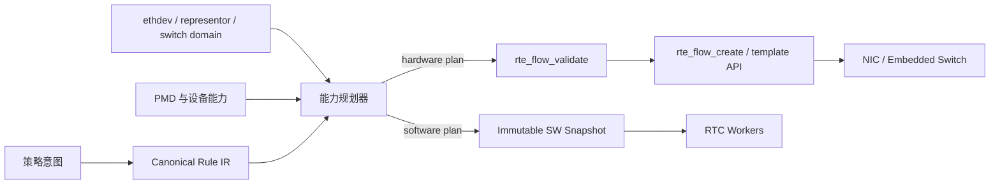
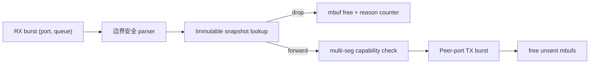

# V3 架构：能力驱动的 DPDK 数据面

## 1. 设计结论

平台以“一个意图、多个可验证执行计划”为核心，而不是让每个包选择 `SOFT/HW/TRANSFER`：

1. 控制面把策略规范化为统一 rule IR。
2. 规划器依据端点拓扑、PMD 能力和 fallback policy 选择软件或硬件实现。
3. 硬件方案经 `rte_flow_validate()` 和真实创建确认；transfer rule 在 embedded switch 中运行。
4. 软件方案发布为 immutable snapshot，由 RX worker 读取。
5. 硬件成功处理的流量不要求再次经过软件 pipeline。



## 2. 端点与执行位置

`ethdev port id` 是进程内句柄，不等同于物理口。普通物理口、PF/VF/SF representor 都可以表现为 ethdev。平台通过 `rte_eth_dev_info_get()` 记录：

- 是否为 representor；
- driver name；
- switch domain id 与 switch port id；
- PMD 报告的 switch name。

ingress/egress rule 作用于指定 ethdev 的接收/发送方向。transfer rule 作用于设备的 embedded switch，常通过 `REPRESENTED_PORT` item/action 在 representor 对应实体之间匹配和转发。transfer 不是“CPU 收包后再转发”的另一条软件 pipeline。

## 3. 控制面模型

### 3.1 Canonical rule IR

当前 IR 明确表达：

- domain：ingress、egress、transfer；
- fallback：require-hardware、prefer-hardware、software-only；
- group、priority、generation 和稳定 rule id；
- 有序 match：ETH、IPv4、UDP、TCP、represented-port；
- action：DROP、QUEUE、MARK、COUNT、represented-port。

IR 校验负责与硬件无关的语义，例如 UDP/TCP 必须跟在 IPv4 后、一个规则只有一个 fate action、QUEUE 只用于 ingress、represented-port 只用于 transfer。编译器再把 IR 映射为 PMD 可验证的 `rte_flow_attr/item/action`。

### 3.2 管理入口与并发边界

daemon 通过权限为 `0600` 的 Unix `SOCK_SEQPACKET` 暴露单规则管理入口。请求由主 lcore 串行处理，因此 rule repository、planner、transaction 和 `rte_flow` 对象仓库当前不需要内部锁。协议携带 version、size 和 request id；v3 仅用于同主机、同版本 C ABI，不作为跨版本或网络传输格式。

`dppctl` 当前提供 port-show、ping、Ethernet/IPv4/UDP/TCP match、DROP/QUEUE/MARK/COUNT action、COUNT query、get 和 delete。apply/delete/count 显式携带 expected generation：硬件事务成功后才发布 desired generation；PMD validate/create/destroy 失败时，repository 不发布半完成状态。

COUNT 查询先从 desired repository 读取已发布 generation，再定位完全一致的硬件 handle，最后调用 `rte_flow_query()`。这样不会把更新窗口中未发布的新 flow 或已退休的旧 flow 计数返回给客户端。查询不重置 counter，并明确区分“没有该规则”“generation 过期”“规则无 COUNT”“PMD 不支持查询”。

规则列表使用 `(after_rule_id, expected_repository_generation)` 游标。排序键是稳定 rule id，而不是可能被删除复用的 repository 槽位；第一页锁定全局 repository generation，后续页若发生任何写入就返回 `ESTALE`。列表只携带类型 mask 和关键字段摘要，完整有序 match/action 由单规则 get 返回。

持久化采用独立 versioned snapshot，不直接 dump C 结构体。codec 显式编码字段、
保存网络字节序协议值、按 rule id 排序并用 CRC32 校验；文件通过同目录临时文件、
`fsync`、原子 `rename` 和父目录 `fsync` 发布。control mutation 已连接完整 snapshot
保存：落盘失败返回 `EUCLEAN` 并进入 dirty/fail-stop，后续写入先修复当前快照，避免
磁盘故障期间持续扩大偏差。management v6 可查询 dirty 和两个 generation，也可显式
flush 当前完整 repository。`--state-path` 启用 v2 snapshot：记录同时保存 canonical
rule 和 install port，启动时先对全部规则 plan/validate/prepare/commit，任一失败逆序
回滚并拒绝启动；全部成功后才发布保留的逐规则及全局 generation。若逆序删除本身失败，
daemon 不启动 worker 而进入 recovery isolation，仅保留已知 handle 并允许受限 retry；
retry 全部成功后退出重启。跨进程无法从 handle 重建未知 flow，因此不得把全端口 flush
当作通用 reconciliation。

端口查询合并 runtime device capability 与 topology endpoint，但只传递无指针的协议快照，不暴露 `rte_eth_dev_info`。它区分 PMD 报告的能力上限与 dppd 实际启用的 offload 子集；由于 `rte_flow` 能力依赖具体 pattern/action 组合，端口快照不能替代逐规则 validate。

### 3.3 目标事务语义

单条 `rte_flow_create()` 不是平台级一致性。完整控制面应采用：

```text
normalize → resolve topology → plan → validate all
          → prepare resources → commit hardware/software
          → publish generation → retire old generation
```

任一步失败都要区分“不支持、资源不足、规则冲突、设备失联”，并回滚已创建对象。V3 当前已实现受限批量创建和精确批量删除；跨规则更新仍在路线图中。

## 4. 软件数据面

当前采用 run-to-completion + RSS：queue `q` 在所有配置端口上只由 worker `q` 轮询，该 worker 同时独占对应 TX queue，避免 fast path 锁。



关键不变量：

- 每个收到的 mbuf 最终只会被 TX 接管一次或释放一次；
- 不假设 header 全部位于首段，`rte_pktmbuf_read()` 负责跨段读取；
- 不对 14 字节 Ethernet 后的 IPv4 头做未对齐结构体解引用，兼容 ARM/DPU；
- 只在设备启用 `RTE_ETH_TX_OFFLOAD_MULTI_SEGS` 时直接发送多段 mbuf，否则先 linearize；
- TX 使用 burst，未发送尾部立即释放并计入 drop；
- fast path 不读写进程级可变策略状态。

## 5. NUMA、队列与内存

- 每个实际使用的 NUMA socket 建一个 mbuf pool；
- RX queue 使用端口所在 socket 的 pool；
- `nb_queues` 同时决定每端口 RX/TX queue 数和 worker 数；
- 多队列要求设备至少提供一种请求的 RSS hash type；
- RSS mask 与 `flow_type_rss_offloads` 求交，不能把不支持能力写给 PMD；
- 生产部署还需把 lcore、NIC PCIe locality、hugepage socket 和流量方向一起规划，当前 CLI 只提供最小安全默认值。

## 6. 并发与生命周期

主 lcore 负责配置、设备启动、管理请求、telemetry、信号和关闭。worker 仅持有只读 snapshot 指针和自己的统计。关闭时先停止接收管理事务，再请求并等待 worker、回收硬件 flow、关闭 pdump 和 ethdev、释放 mempool，最后执行 EAL cleanup。

动态软件策略更新已采用 generation + DPDK QSBR：控制面复制当前 classifier snapshot、修改副本并原子发布；worker 每轮完整 ingress 扫描后报告 quiescent，控制面以非阻塞方式检查宽限期并回收旧版本。不能在 worker 正在读取时原地修改表；规则 COUNT 计数器独立于 snapshot 数组，克隆规则集不会清空已发布规则的计数。

## 7. 可观测性

每个 worker 维护 RX/TX 包与字节、malformed、unsupported、policy drop、TX drop。控制面按需聚合，fast path 每 burst 才做一次 relaxed atomic 累加。DPDK telemetry 暴露 `/dppd/stats`。pdump 默认关闭，因为真正启用 capture callback 后会复制包并影响性能。

后续需要补充：按 port/queue/rule/backend 的指标、规则安装延迟和失败分类、xstats、流量命中率、资源水位、generation 与健康状态。

## 8. 能力与 fallback 原则

`PREFER_HARDWARE` 不等于忽略硬件失败。规划器必须保存 validate 结果和降级原因，再安装等价软件实现；如果软件语义不等价，则不能降级。`REQUIRE_HARDWARE` 创建失败时整笔意图失败。`SOFTWARE_ONLY` 不应调用硬件编译器。

当前软件 pipeline 只有 L2 port-pair 语义，因此尚不能为任意 rule IR 提供等价软件 fallback。代码明确返回错误，避免“接口成功、功能未生效”。

## 9. 演进方向

- 软件分类：exact-match/hash、ACL、LPM、stateful conntrack/NAT，以独立 stage 组合；
- 硬件规模化：flow template/table、indirect/shared action、aged flow、async queue；
- DPU 管理：host/DPU 双控制面 ownership、恢复与重放、设备热插拔；
- representor：devargs 发现、同 switch-domain 验证、uplink/PF/VF/SF 角色解析；
- 一致性：批量事务、generation、幂等 API、持久化期望状态与 reconciliation；
- 性能：NUMA-aware worker placement、RX/TX descriptor 调优、prefetch、vectorized software classifier、backpressure 策略。
