# DPDK Dataplane Platform V4 — 架构画布

> 本文只定义平台级总体结构、一级模块边界和关键闭环，不进入 C API、结构体、RPC schema、数据库表或线程实现。

## 1. 画布目标

平台不是一个“增强版 l2fwd”，而是一个持续管理 desired state、执行计划和实际数据面状态的系统：

- 用户声明想要的网络策略，而不是直接调用某个 PMD；
- 平台解析 ethdev、PF/VF/SF、representor 和 embedded-switch 拓扑；
- planner 根据能力、资源、策略约束选择 software、`rte_flow` 或未来 vendor backend；
- transaction engine 负责有序提交、失败回滚和 generation 发布；
- reconciler 持续比较 desired state 与 actual state，并在设备变化或进程恢复后重建；
- dataplane executor 只执行已经发布的软件 snapshot，不承担平台控制逻辑。

---

## 2. L0：系统总画布

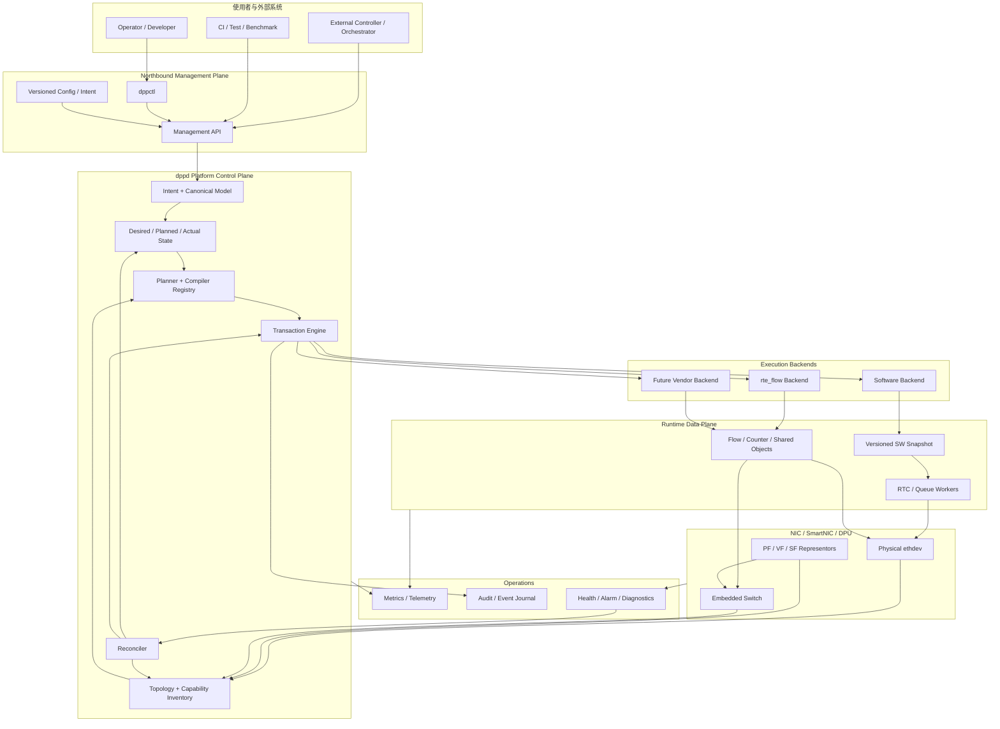

### 总体边界

- Northbound 描述“想要什么”。
- Control Plane 决定“应该怎样实现”。
- Backend 负责“在某一种执行环境中落地”。
- Runtime 承载“当前已提交的实际执行对象”。
- Reconciler 保证系统不会只在第一次启动时正确。
- Operations 让每次选择、降级、失败和恢复都可解释。

---

## 3. L1：平台内部模块总图

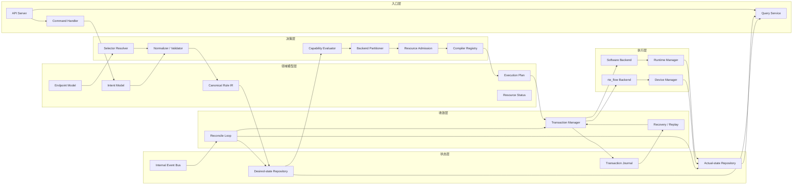

---

## 4. 三条关键闭环

### 4.1 配置提交闭环

```mermaid
flowchart LR
    Apply["Apply Intent"] --> Schema["Schema Validation"]
    Schema --> Normalize["Normalize"]
    Normalize --> Resolve["Resolve Endpoint Selectors"]
    Resolve --> Plan["Build Execution Plan"]
    Plan --> Admit["Capability + Resource Admission"]
    Admit --> Validate["Validate All Operations"]
    Validate --> Prepare["Prepare SW/HW Resources"]
    Prepare --> Commit["Ordered Commit"]
    Commit --> Publish["Publish Generation"]
    Publish --> Actual["Update Actual State"]
    Actual --> Result["Return Transaction Result"]
    Validate -->|"failure"| Reject["Reject Without Mutation"]
    Prepare -->|"failure"| Rollback["Rollback Prepared Objects"]
    Commit -->|"partial failure"| Rollback
```

### 4.2 数据包执行闭环

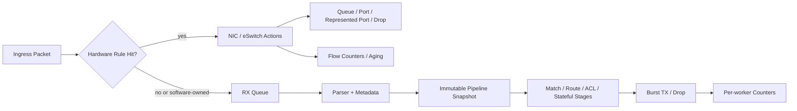

### 4.3 状态收敛闭环

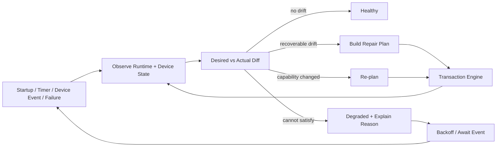

---

## 5. 模块画布 A：Management Plane

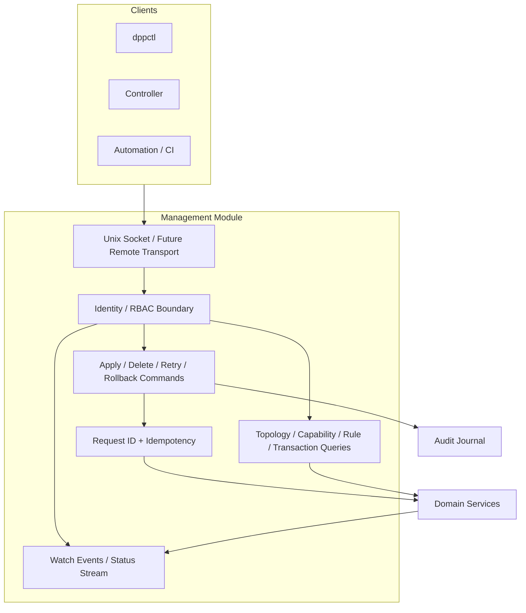

Management Plane 不直接创建 `rte_flow`，也不直接修改 worker snapshot。它只提交领域命令、查询状态和观察事件。

---

## 6. 模块画布 B：Intent、Model 与 State

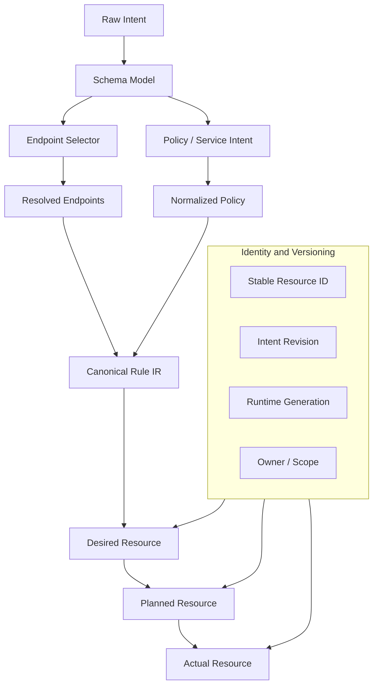

核心状态不是一个布尔值，而是三层：

- Desired：用户声明的目标。
- Planned：经过拓扑与能力决策后的执行计划。
- Actual：当前软件 snapshot 和硬件对象的真实安装状态。

---

## 7. 模块画布 C：Topology 与 Capability

```mermaid
flowchart LR
    subgraph Sources["Discovery Sources"]
        EAL["EAL Device Events"]
        EthInfo["rte_eth_dev_info"]
        FlowProbe["rte_flow Validation Probes"]
        Xstats["Link / xstats / Health"]
        VendorInfo["Optional Vendor Discovery"]
    end

    subgraph Inventory["Inventory"]
        Device["Device"]
        Port["ethdev Port"]
        Representor["Representor"]
        Entity["PF / VF / SF / Uplink Entity"]
        Switch["Switch Domain"]
        Queue["Queue / NUMA / RSS"]
    end

    subgraph CapabilityModel["Capability Profile"]
        QueueCaps["Queue + RSS Caps"]
        PacketCaps["RX/TX Offload Caps"]
        FlowCaps["Domain + Item + Action Caps"]
        ScaleCaps["Template / Async / Resource Limits"]
        LifecycleCaps["Reset / Keep / Replay Behavior"]
    end

    Sources --> Inventory
    Inventory --> CapabilityModel
    Inventory --> Graph["Endpoint Topology Graph"]
    CapabilityModel --> Snapshot["Versioned Capability Snapshot"]
    Graph --> Resolver["Endpoint Selector Resolver"]
    Snapshot --> Planner["Planner"]
    Resolver --> Planner
```

拓扑图解决“这些 port id 代表谁、彼此如何连接”；capability profile 解决“在当前 PMD、设备和固件组合上能做什么”。

---

## 8. 模块画布 D：Planner 与 Compiler Registry

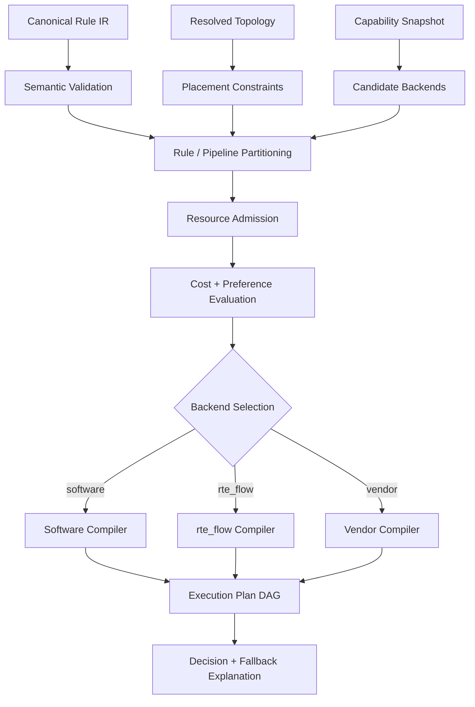

Planner 的输出不是“backend 枚举”，而是一张有依赖关系的 execution plan DAG，其中包含资源需求、提交顺序、回滚动作和验证证据。

---

## 9. 模块画布 E：Transaction Engine

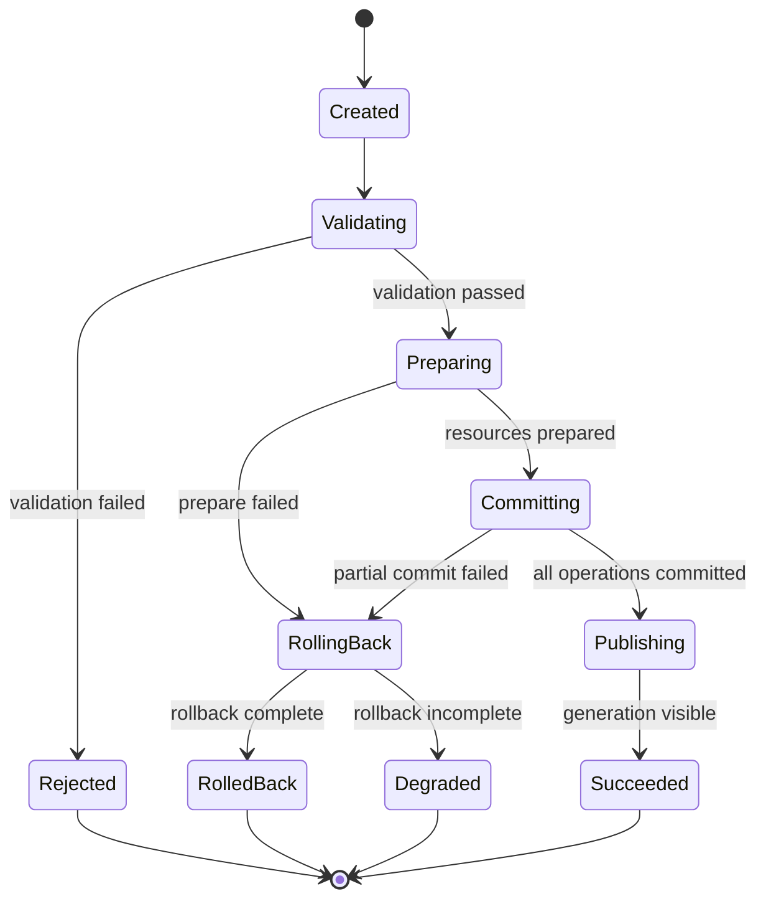

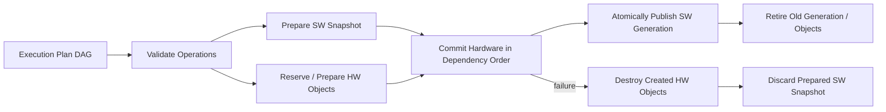

DPDK flow create 并不天然提供跨多条规则的全局原子事务，因此平台事务属于“有序提交 + 补偿回滚 + 明确 degraded 状态”，不能伪装成硬件两阶段提交。

---

## 10. 模块画布 F：Reconciler

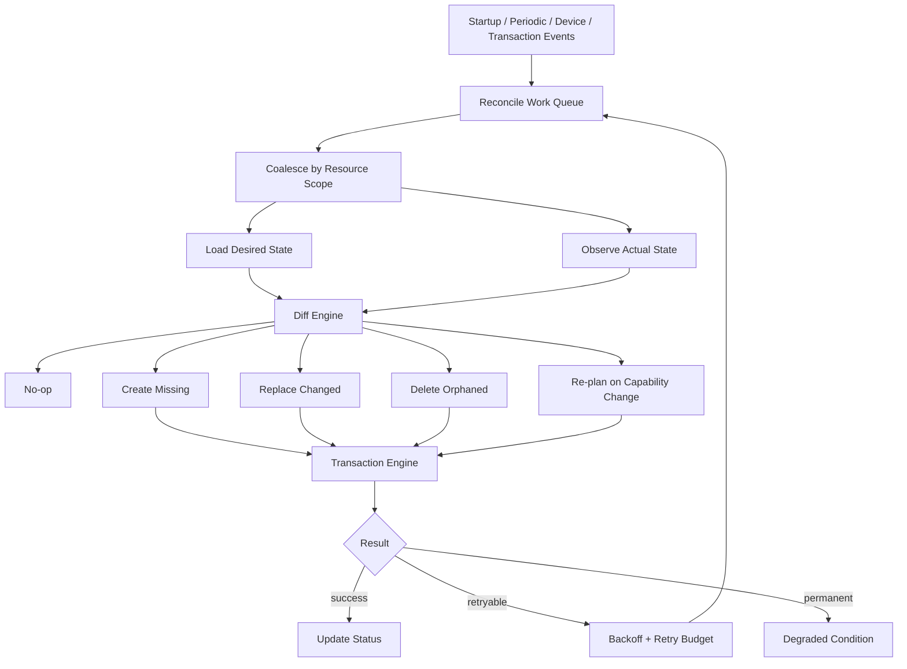

Reconciler 是平台与 demo 的关键分界：设备 reset、representor 重新枚举、进程重启或规则漂移后，系统必须再次收敛，而不是要求人工重新启动全部配置。

---

## 11. 模块画布 G：Backend Framework

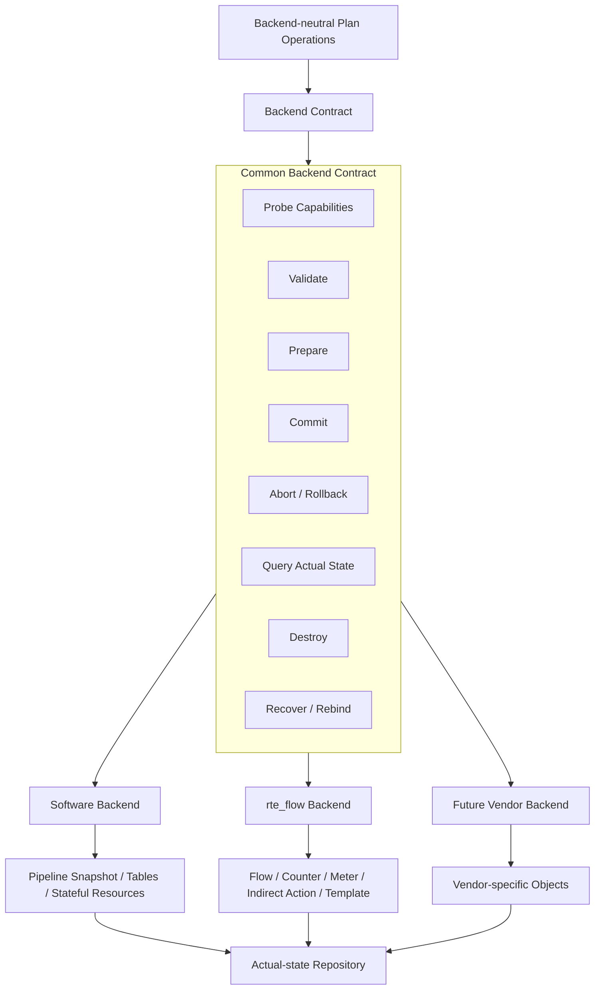

Backend 之间共享生命周期和错误模型，但不共享私有对象。`rte_flow *`、vendor handle 和 software table pointer 都不能泄漏到 canonical model。

---

## 12. 模块画布 H：Software Dataplane

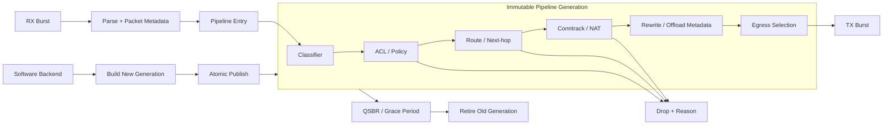

软件 pipeline 是可组合 stage graph，不把 ACL、route、NAT 和 parser 混成一个巨型 worker 函数。worker 只持有当前 generation 的只读引用。

---

## 13. 模块画布 I：Runtime 与 Device Manager

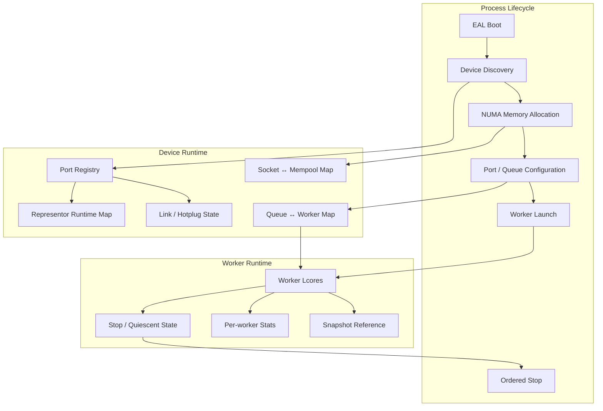

Runtime Manager 管资源与生命周期；Topology Manager 管语义关系；Backend 管规则对象。三者不能合并成一个全局 port context。

---

## 14. 模块画布 J：Observability 与 Operations

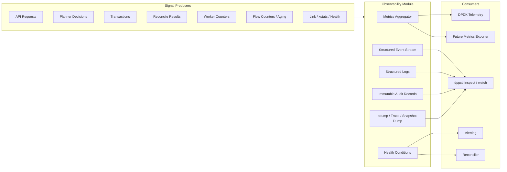

平台至少要回答：用户要求了什么、planner 选择了什么、为什么降级、创建了哪些实际对象、哪一步失败、是否回滚完成、当前是否发生漂移。

---

## 15. 进程与线程画布

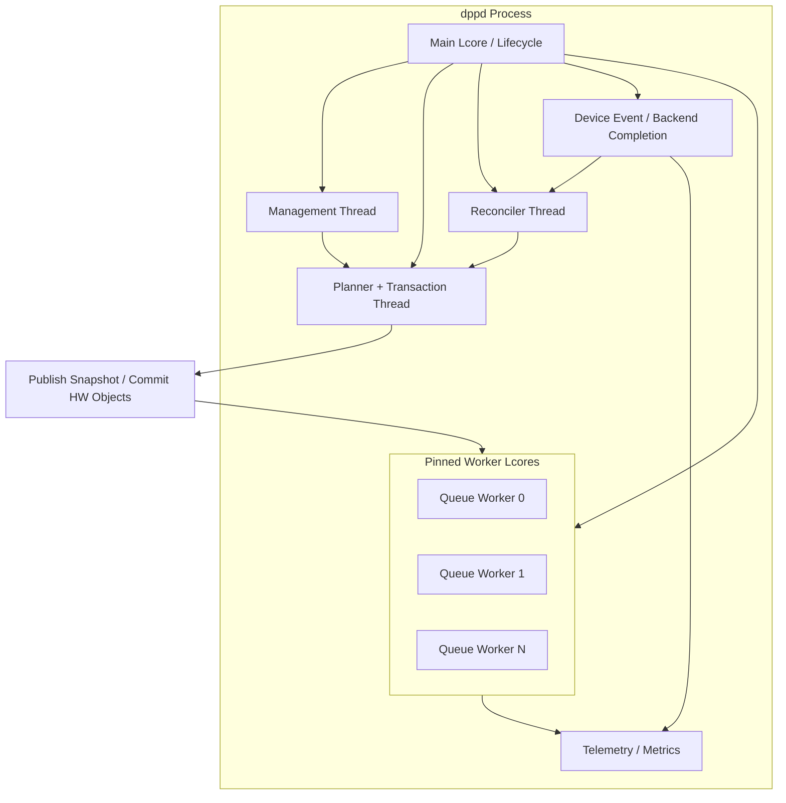

线程数量不是最终决定；这里先固定 ownership：慢路径状态只能由控制域修改，worker 不执行策略变更，管理请求也不能直接触碰 fast-path 对象。

---

## 16. Host / SmartNIC / DPU 部署画布

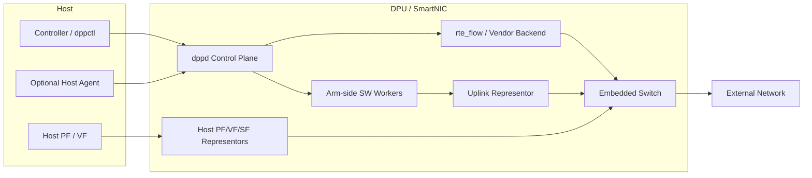

后续需要明确每种部署的唯一 ownership：谁创建 representor、谁拥有 flow namespace、谁负责持久化 desired state、DPU 重启后由谁触发 replay。

---

## 17. 一级资源状态模型

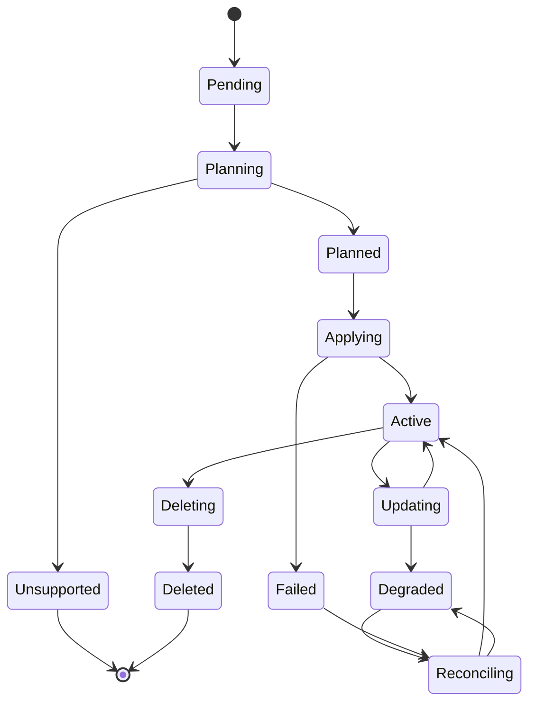

每个资源状态必须带 reason、observed generation、backend、最近 transaction id 和可重试性，而不是只有 success/failure。

---

## 18. 设计不变量

1. Canonical model 不包含 `rte_flow *`、mbuf、PMD 私有句柄。
2. 管理 API 不直接操作端口、worker 或 flow object。
3. Planner 只生成计划，不产生外部副作用。
4. 所有副作用通过 transaction engine 和 backend contract 发生。
5. Actual state 来自可观察对象，不能仅根据“曾经调用成功”推断。
6. 软件 snapshot 发布后不可原地修改。
7. representor 是拓扑端点；transfer 是硬件 domain，不是逐包软件模式。
8. `PREFER_HARDWARE` 必须记录选择和降级证据；语义不等价时不得 fallback。
9. 回滚不完整必须进入 degraded，而不是返回普通 success。
10. 设备与能力变化必须触发 reconciliation。

---

## 19. 下一轮细分入口

本文停留在总体与一级模块。下一轮可以按以下顺序继续拆分：

1. 领域对象：Endpoint、Intent、Rule IR、Plan、Actual Resource、Condition。
2. Backend contract：操作集合、错误分类、对象 ownership、幂等规则。
3. Transaction：plan DAG、提交顺序、补偿动作、journal 与恢复。
4. Topology：PF/VF/SF/uplink/representor graph 和 selector 语义。
5. Software pipeline：stage contract、snapshot layout、QSBR 更新协议。
6. Management API：命令、查询、watch、request id 和版本冲突。
7. 进程模型：线程、消息队列、锁边界和 shutdown 时序。
8. 持久化：desired state、journal、actual cache 和启动恢复。

在这些细分得到确认前，不进入代码重构。
